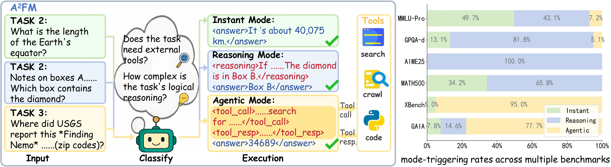
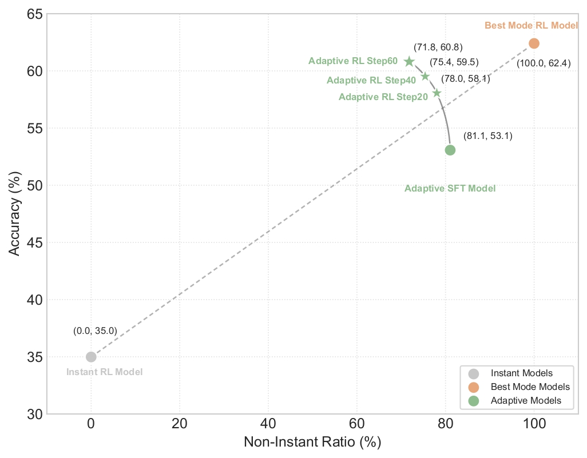
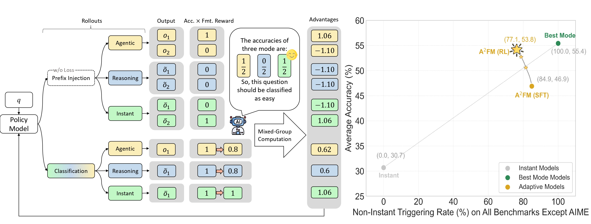

<div align="center">

<h2>A^2FM: An Adaptive Agent Foundation Model for Tool-Aware Hybrid Reasoning</h2>

</div>

<div align="center">
  <a href='https://chain-of-agents-afm.github.io/'></a>
  <a href='https://arxiv.org/abs/'></a>
  <a href='https://huggingface.co/collections/PersonalAILab/afm-689200e11d0b21a67c015ba8'></a>
  <a href='https://huggingface.co/collections/PersonalAILab/afm-datasets-6892140eaad360ea5ccdcde1'></a>
</div>

This is the official repository for our paper "A^2FM: An Adaptive Agent Foundation Model for Tool-Aware Hybrid Reasoning". This is an adaptive branch of [AFM](https://github.com/OPPO-PersonalAI/Agent_Foundation_Models/). Different problems are solved using different modes (agentic, reasoning, instant) to ensure that every token consumption is put to the best use. Our work provides an approach that leverages the accuracy rate in inter-gro2up rollouts within Reinforcement Learning (RL), using the difficulty level of problems to train the model's adaptive capability.

<div align="center">
  
</div>

# Overview 🎯

A^2FM presents a **unified framework** that bridges the gap between reasoning-centric and agentic LLMs through adaptive mode selection, achieving superior performance while dramatically reducing costs.

<div align="center">
  
</div>

## Key Innovations & Highlights

🧠 **Route-then-Align Principle**: A unified framework that bridges reasoning-centric and agentic LLMs through adaptive mode selection, eliminating the inefficiency gap where both families tend to overthink or over-call tools.

⚡ **Three-Mode Architecture**: 
- **Instant Mode**: Direct reasoning for simple tasks (no tool calls)
- **Agentic Mode**: Tool-augmented reasoning for complex problems  
- **Reasoning Mode**: Deep chain-of-thought for analytical tasks

🎯 **Adaptive Policy Optimization (APO)**: The key to training efficient models - enforces adaptive sampling across modes with cost-regularized rewards.

### Training Efficient Models with APO

<div align="center">
  
</div>

**Method**: APO applies cost-regularized rewards and adaptive sampling to optimize mode selection, ensuring every token consumption delivers maximum value.

<div align="center">
  
</div>

**Results**: 
- **New SOTA**: 13.4% on BrowseComp, 70.4% on AIME25, 16.7% on HLE
- **45.2% cost reduction** relative to reasoning models, **33.5%** relative to agentic models
- **$0.00487 per correct answer** - substantially higher cost efficiency while maintaining comparable accuracy

# Table of Contents

- [Overview](#overview-)
  - [Key Innovations & Highlights](#key-innovations--highlights)
  - [Training Efficient Models with APO](#training-efficient-models-with-apo)
- [Quick Start](#quick-start)
  - [Tool Server Deployment](#1-tool-server-deployment)
  - [Model Download & Inference](#2-model-download--inference)
    - [Model Download](#model-download)
    - [Deploy Model Server](#deploy-model-server)
    - [Run Inference](#run-inference)
      - [Key Parameters](#key-parameters)
- [Related Work](#related-work)
- [Acknowledgement](#acknowledgement)
  - [Citation](#citation)
- [Star](#star)

# Quick Start

## 1. Tool Server Deployment

Our tool server infrastructure provides **highly stable and fast** tool execution capabilities, which are crucial for both RL training and inference. The system features:

- **🔄 Cache Hit Functionality**: Intelligent caching mechanism reduces redundant API calls and improves response times
- **🛡️ Error Handling & Retry Mechanisms**: Robust error capture and automatic retry logic ensure reliable tool execution
- **⚡ Asynchronous Acceleration**: Multi-threaded and async processing for concurrent tool operations
- **🔧 Multi-API Support**: Fallback mechanisms across multiple API providers for enhanced reliability

Starting tool servers, refer to `./server/SERVER_README.md`:


**Available Tool Servers:**

- **Web Search Server**: Multi-API Google search with intelligent caching
- **Page Crawler Server**: Concurrent page crawling with AI-powered summarization
- **Code Executor Server**: Secure Python code execution in nsjail sandbox


## 2. Model Download & Inference

### Install Dependencies
First, install the required dependencies by executing the command below to install packages listed in `requirements.txt`:
```bash
pip install -r requirements.txt
```

### Model Download

You can directly download the model by following the links below.

| Model | Download Links | Model Size | Context Length |
| :-----------------: | :-----------------------------------------: | :----------: | :--------------: |
| A^2FM-32B-rl | [🤗 HuggingFace](https://huggingface.co/PersonalAILab/A2FM-32B-rl) | 32B | 128K |

**Alternative Download Methods:**

1. **Direct from HuggingFace**: Click the 🤗 HuggingFace link above
2. **Script Download**: 
   ```bash
   cd ./model
   python download.py
   ```

### Deploy Model Server

Deploy A^2FM using vLLM for high-performance inference:

```bash
cd ./deploy
bash ./deploy.sh
```

### Run Inference

**1. Set Environment Variables**

Before running inference, you must set the following required environment variables:

```bash
# Model Configuration
export MODEL_NAME="A2FM-32B-rl"
export MODEL_URL="http://localhost:8000/v1"

# OpenAI API Configuration (for judge and summary models)
export OPENAI_API_URL="https://api.openai.com/v1"
export OPENAI_API_KEY="your-openai-api-key-here"

# Tool Server URLs
export WEBSEARCH_URL="http://localhost:9002"
export CRAWL_PAGE_URL="http://localhost:9000"
export CODE_EXEC_URL="http://localhost:9003"

# JINA API Key (for web search and page crawling)
export JINA_API_KEY="your-jina-api-key-here"
```

**2. Run Inference**

Prepare a test dataset (refer to `/data/example.json` format) and run inference. The input is .json/.jsonl file and the output is .jsonl file.

```bash
cd ./infer
python infer_main.py --input_file ../data/example.json --output_file ../results/output.jsonl
```

**Quick Start with Example Script:**

```bash
cd ./infer
# Edit example_infer_main.sh to set your actual API keys and URLs
bash example_infer_main.sh
```

#### Key Parameters

**Adaptive Mode Selection (`--adaptive`)**:
- `auto`: Automatic mode selection based on task complexity (recommended)
- `toolcalling_agent`: Force agentic mode with tool usage for complex tasks
- `reasoning_agent`: Force reasoning mode for analytical tasks
- `instant`: Force instant mode for simple tasks (no tool calls)

**Max Steps Configuration**:
- `--max_steps_agent`: Maximum execution steps for agentic mode (default: 60)

**Example Usage**:

```bash
cd ./infer
# Auto mode with custom parameters
python infer_main.py \
    --input_file ../data/example.json \
    --output_file ../results/output.jsonl \
    --adaptive auto \
    --max_steps_agent 60 \
    --temperature 1.0 \
    --parallel_per_dataset 5

# Force agentic mode
python infer_main.py \
    --input_file ../data/example.json \
    --output_file ../results/agentic_output.jsonl \
    --adaptive toolcalling_agent \
    --max_steps_agent 100

# Force instant mode
python infer_main.py \
    --input_file ../data/example.json \
    --output_file ../results/instant_output.jsonl \
    --adaptive instant 
```

**Help**: Run `python infer_main.py --help` for complete parameter list.

# Related Work
Listed below are friendly links to relevant agents works from OPPO PersonalAI Lab:

- [Flash-Searcher](https://github.com/OPPO-PersonalAI/Flash-Searcher): Fast and Effective Web Agents via DAG-Based Parallel Execution
- [Agent Foundation Models](https://github.com/OPPO-PersonalAI/Agent_Foundation_Models): Chain-of-Agents: End-to-End Agent Foundation Models via Multi-Agent Distillation and Agentic RL
- [TaskCraft](https://github.com/OPPO-PersonalAI/TaskCraft): Automated Generation of Agentic Tasks
- [OAgents](https://github.com/OPPO-PersonalAI/OAgents): An Empirical Study of Building Effective Agents
- [Agent-KB](https://github.com/OPPO-PersonalAI/Agent-KB): Leveraging Cross-Domain Experience for Agentic Problem Solving
- [MiCoTA](https://github.com/OPPO-PersonalAI/MiCoTA): Bridging the Learnability Gap with Intermediate CoT and Teacher Assistants

# Acknowledgement

We would like to express our sincere gratitude to the original authors and contributors of LLaMA-Factory and verl, an excellent open-source project that provided a solid foundation for our work. Our implementation has been adapted from the [LLaMA-Factory](https://github.com/hiyouga/LLaMA-Factory) and [verl](https://github.com/volcengine/verl).

## Citation

If you find `A^2FM` useful in your research or applications, we would appreciate it if you could cite our work:

```bibtex
@article{xxxx,
  title={A^2FM: An Adaptive Agent Foundation Model for Tool-Aware Hybrid Reasoning},
  author={Qianben Chen and Jingyi Cao and Jiayu Zhang and Tianrui Qin and Xiaowan Li and King Zhu and Dingfeng Shi and He Zhu and Minghao Liu and Xiaobo Liang and Ge Zhang and Jian Yang and Yuchen Eleanor Jiang and Wangchunshu Zhou},
  journal={arXiv preprint arXiv:xxxx.xxxxx},
  year={2025}
}
```

# Star

<div align="center">

[](https://github.com/OPPO-PersonalAI/Adaptive_Agent_Foundation_Models)

</div>
